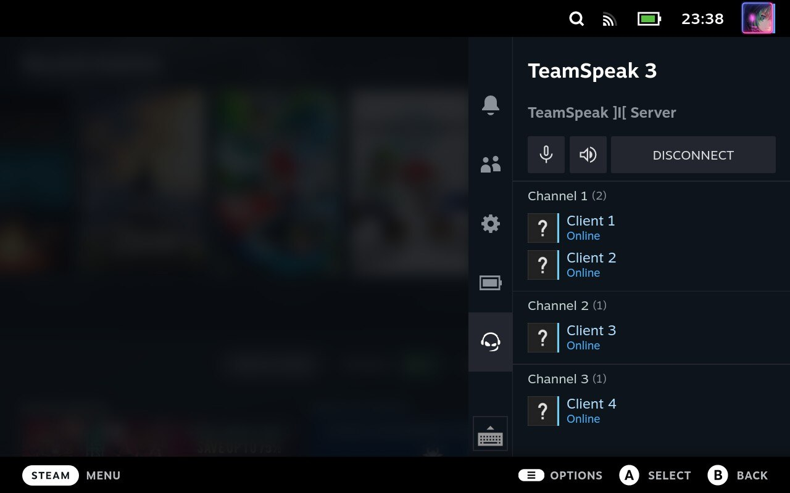
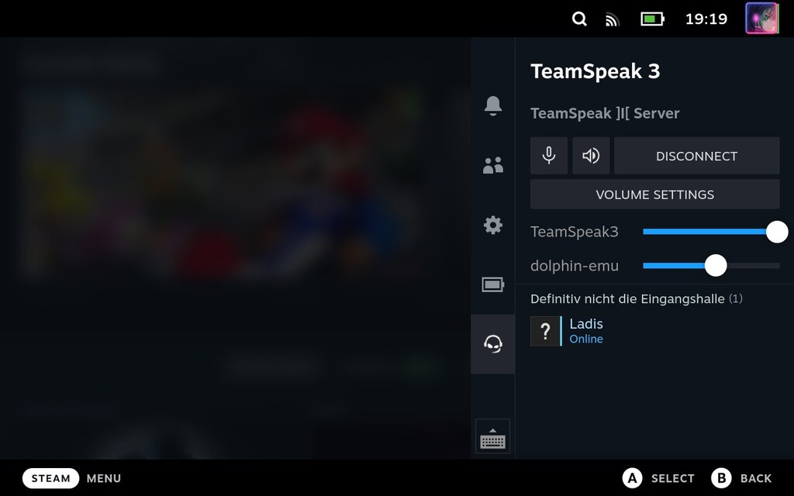

A TeamSpeak 3 client and [DeckyLoader](https://github.com/SteamDeckHomebrew/PluginLoader) plugin that integrates TeamSpeak 3 into Steam Deck's quick access menu.

## Features

- Connect to bookmarked servers.
- See connected clients and join their channels.
- Mute/Unmute microphone and speakers.
- Control audio volumes of running applications.
- Disconnect from current server.
- Push-to-Talk via shoulder buttons (bound to L5).

**Missing/Planned features**:  
- Display client avatars and their current status.
- Make Push-to-Talk button configurable.
- Start/stop TeamSpeak client which is running in the background.

## Building

The following dependencies are required to build the TeamSpeak 3 client plugin:
1. [mjson](https://github.com/cesanta/mjson): for JSON parsing
1. [mongoose](https://github.com/cesanta/mongoose): for HTTP server/client and web sockets
1. [incbin](https://github.com/graphitemaster/incbin): for embedding static resources
1. [ts3client-pluginsdk](https://github.com/TeamSpeak-Systems/ts3client-pluginsdk): the TeamSpeak 3 plugin SDK
1. libpulse: to control audio volumes of applications

To download dependencies 1-4 run `make vendor` (this requires `wget`). All other dependencies need to be installed manually. Then run `make` to build the plugin.

Change the working directory to `backend/` before issuing any `make` commands.

## Installing

Follow these steps in order to install and setup the plugin on your Steam Deck:
1. Install DeckyLoader on your SteamDeck as described [here](https://github.com/SteamDeckHomebrew/PluginLoader).
1. Switch to desktop mode, download TeamSpeak from the Discover store and launch it.
1. Add all TeamSpeak servers you want to connect to as bookmarks (Bookmarks ⇾ Manage Bookmarks).
1. If you want to use Push-to-Talk allow TeamSpeak to access your Steam Deck inputs: `flatpak override --user com.teamspeak.TeamSpeak --device=all`
1. Switch back to gaming mode and install TS3 QuickAccess from the DeckyLoader store.

To install the plugin manually follow steps 2-3 from above and then:
1. Download a [pre build version](https://github.com/ILadis/ts3-qs4sd/releases) of the DeckyLoader plugin.
1. Extract the ZIP archive on your Steam Deck to the `plugins/` directory of your DeckyLoader installation.
