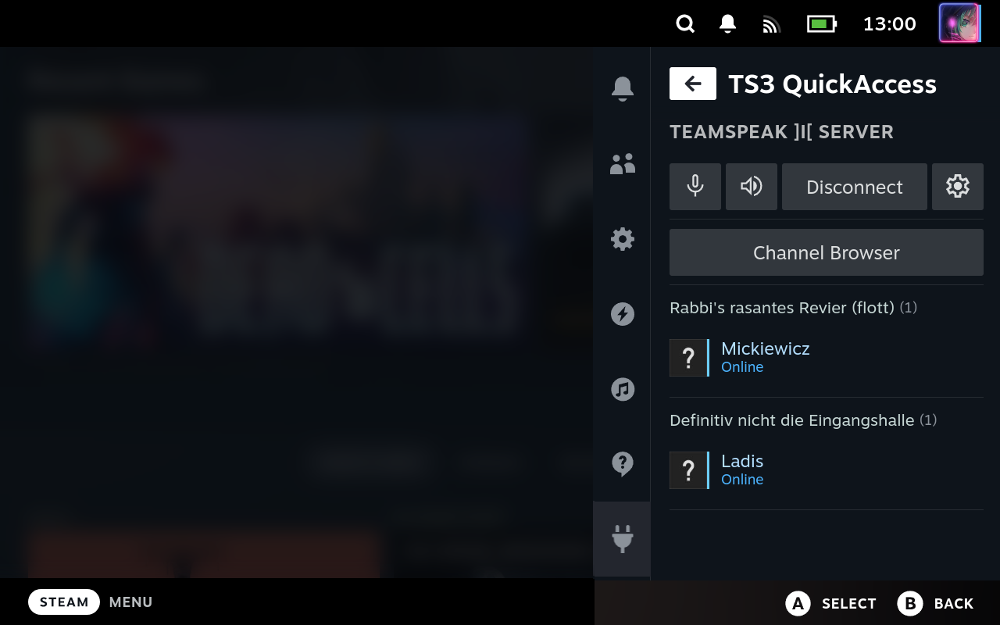

A TeamSpeak 3 client and [DeckyLoader](https://github.com/SteamDeckHomebrew/PluginLoader) plugin that integrates TeamSpeak 3 into Steam Deck's quick access menu.




## Features

- Connect to bookmarked servers.
- See connected clients and join their channels.
- Browse and join available channels on the server.
- See client avatars and their current status.
- Mute/Unmute microphone and speakers.
- Control audio volumes of running applications.
- Push-to-Talk via shoulder buttons (L/R 4-5).
- Disconnect from current server.

## Building

### Backend

The following dependencies are required to build the TeamSpeak 3 client plugin:
1. [mongoose](https://github.com/cesanta/mongoose): for HTTP server/client and web sockets
1. [ts3client-pluginsdk](https://github.com/TeamSpeak-Systems/ts3client-pluginsdk): the TeamSpeak 3 plugin SDK
1. libpulse: to control audio volumes of applications
1. libsqlite3: to inject bookmarks into TeamSpeak 3 settings.db

To download dependencies 1-2 run `make vendor` (this requires `curl`). All other dependencies need to be installed manually. Then run `make` to build the plugin.

Change the working directory to `backend/` before issuing any `make` commands.

### Frontend

The following tools are required to build the DeckyLoader plugin:
1. [Node.js](https://nodejs.org): JavaScript runtime required for building
1. [pnpm](https://pnpm.io): package manager for JavaScript/Node.js

After all required tools are installed run the following commands to build the frontend:

```sh
$ pnpm install
$ pnpm run /^build/
```

This should create a `plugin.zip` file containing both the front- and backend part of the plugin.

## Installing

Follow these steps in order to install and setup the plugin on your Steam Deck:
1. Install DeckyLoader on your Steam Deck as described [here](https://github.com/SteamDeckHomebrew/PluginLoader).
1. Switch to desktop mode, download TeamSpeak 3 from the Discover store and launch it.
1. Add all TeamSpeak servers you want to connect to as bookmarks (Bookmarks ⇾ Manage Bookmarks).
1. If you want to use Push-to-Talk allow TeamSpeak to access your Steam Deck inputs:  
   `flatpak override --user com.teamspeak.TeamSpeak3 --device=all`
1. Switch back to gaming mode and install TS3 QuickAccess from the DeckyLoader store.

To install the plugin manually follow steps 1-4 from above and then:
1. Download a [pre build version](https://github.com/ILadis/ts3-qs4sd/releases) of the DeckyLoader plugin and copy it to your Steam Deck.
1. Go to DeckyLoader settings and enable developer mode.
1. Open the DeckyLoader developer menu and select "Install Plugin from ZIP File".
